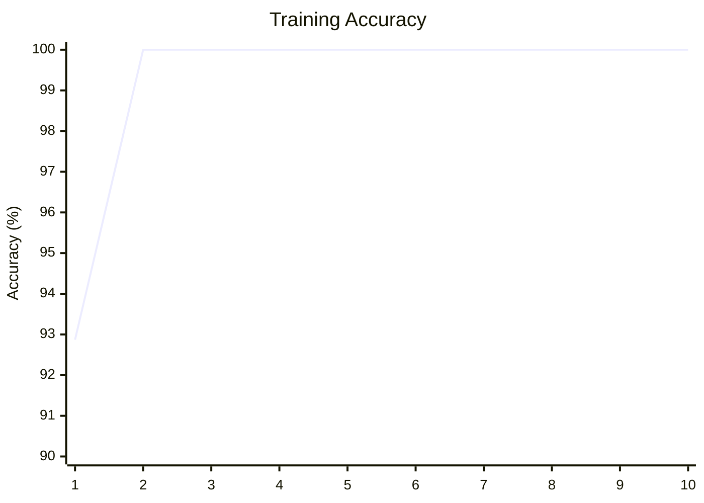

# 图像识别任务

# 果蔬分类 课程答辩

---
layout: two-cols
layoutClass: gap-16
---

# 任务概述

**数据集来源**: Kaggle Fruits 360

<div class="text-sm">

| 项目       | 内容        |
| ---------- | ----------- |
| 总图片数   | 90,483 张   |
| 原始类别   | 131 种果蔬  |
| 图片尺寸   | 100×100 RGB |
| 本任务类别 | 10 类       |

</div>

**选定类别**:
苹果、香蕉、橙子、草莓、西红柿、黄瓜、茄子、葡萄、芒果、西瓜

::right::
# 数据集示例

<div class="grid grid-cols-5 gap-2 pt-4">
  <div></div>
  <div></div>
  <div></div>
  <div></div>
  <div></div>
  <div></div>
  <div></div>
  <div></div>
  <div></div>
  <div></div>
</div>

<div class="pt-4 text-sm">

```python
# 检测到的类别总数
num_classes = 10
class_names = ['apple', 'banana', 'orange',
               'strawberry', 'tomato', 'cucumber',
               'eggplant', 'grape', 'mango',
               'watermelon']
```
</div>

---
layout: two-cols
layoutClass: gap-16
---

# 数据预处理

**训练集增强**:

```python
train_transform = transforms.Compose([
    transforms.Resize((100, 100)),
    transforms.RandomHorizontalFlip(p=0.5),
    transforms.RandomRotation(20),
    transforms.ToTensor(),
    transforms.Normalize(
        [0.485, 0.456, 0.406],
        [0.229, 0.224, 0.225]
    )
])
```

**测试集标准化**:

```python
test_transform = transforms.Compose([
    transforms.Resize((100, 100)),
    transforms.ToTensor(),
    transforms.Normalize(
        [0.485, 0.456, 0.406],
        [0.229, 0.224, 0.225]
    )
])
```

::right::

# 数据加载

**数据加载配置**:

```python
from torch.utils.data import DataLoader
train_loader = DataLoader(
    full_train_dataset,
    batch_size=256,
    shuffle=True
)
test_loader = DataLoader(
    full_test_dataset,
    batch_size=256,
    shuffle=False
)
```

**环境配置**:

```python
device = torch.device(
    "cuda" if torch.cuda.is_available() else "cpu"
)
# 当前使用的设备: cuda
```

---
layout: two-cols
layoutClass: gap-16
---

# 模型 1: Simple CNN

**网络结构**:

```python
model_cnn = nn.Sequential(
    nn.Conv2d(3, 16, kernel_size=3, padding=1),
    nn.ReLU(),
    nn.MaxPool2d(2, 2),
    nn.Conv2d(16, 32, kernel_size=3, padding=1),
    nn.ReLU(),
    nn.MaxPool2d(2, 2),
    nn.Flatten(),
    nn.Linear(32*25*25, 256),
    nn.ReLU(),
    nn.Linear(256, num_classes)
).to(device)
```

**优化器配置**:

```python
criterion = nn.CrossEntropyLoss()
optimizer_cnn = optim.Adam(
    model_cnn.parameters(),
    lr=0.001
)
```

::right::

# CNN 训练过程

**训练循环**:

```python
for epoch in range(5):
    model_cnn.train()
    running_loss = 0.0
    for images, labels in train_loader:
        optimizer_cnn.zero_grad()
        outputs = model_cnn(images)
        loss = criterion(outputs, labels)
        loss.backward()
        optimizer_cnn.step()
        running_loss += loss.item()
```

采用序列化设计，通过两层卷积-激活-池化的经典组合，逐步提取并压缩图像特征，最终由全连接层完成分类

使用交叉熵损失函数衡量预测误差，并配置Adam优化器自动调整学习率

---
layout: two-cols
layoutClass: gap-16
---

# CNN 训练结果
### 简单 CNN 在 5 轮内实现快速收敛

**训练数据**:

<div class="text-sm">

| Epoch | Loss   |
| ----- | ------ |
| 1     | 0.9560 |
| 2     | 0.1175 |
| 3     | 0.0413 |
| 4     | 0.0209 |
| 5     | 0.0118 |

</div>

::right::
# Loss 变化曲线

```mermaid {scale: 0.6}
xychart-beta
    title "Training Loss"
    x-axis [1, 2, 3, 4, 5]
    y-axis "Loss" 0 --> 1
    line [0.956, 0.118, 0.041, 0.021, 0.012]
```
**收敛分析**:
- Epoch 1→2: Loss 大幅下降 87.7%
- Epoch 2→3: 继续快速下降
- Epoch 3→5: 逐渐收敛至 0.0118

---
layout: two-cols
layoutClass: gap-16
---

# 模型 2: ResNet

**迁移学习配置**:

```python
weights = ResNet18_Weights.DEFAULT
model_resnet = resnet18(weights=weights)
model_resnet.fc = nn.Linear(
    model_resnet.fc.in_features,
    num_classes
)
model_resnet = model_resnet.to(device)
```

**优化器与学习率调度**:

```python
optimizer_res = optim.Adam(
    model_resnet.parameters(),
    lr=0.0001
)
scheduler = optim.lr_scheduler.StepLR(
    optimizer_res,
    step_size=5,
    gamma=0.1
)
```

::right::

# ResNet 训练过程

**强化训练循环**:
```python
for epoch in range(10):
    model_resnet.train()
    running_loss = 0.0
    correct, total = 0, 0
    for images, labels in train_loader:
        optimizer_res.zero_grad()
        outputs = model_resnet(images)
        loss = criterion(outputs, labels)
        loss.backward()
        optimizer_res.step()
        _, predicted = torch.max(outputs.data, 1)
        total += labels.size(0)
        correct += (predicted == labels).sum().item()
    scheduler.step()
    acc = 100 * correct / total
    print(f"Epoch {epoch+1}, Accuracy: {acc:.2f}%")
```
<div class="text-sm">

加载 `ImageNet` 预训练权重，仅替换最后的全连接层以适应 10 分类任务，
使用更小的学习率 `0.0001` 微调，配合 `StepLR` 调度器每 5 轮衰减学习率。

</div>

---
layout: two-cols
layoutClass: gap-16
---

# ResNet18 训练结果
### 迁移学习在第 2 轮即达到几乎 100% 准确率

**训练数据**:

<div class="text-sm">

| Epoch | Accuracy (%) | Learning Rate |
| ----- | ------------ | ------------- |
| 1     | 92.87        | 0.0001        |
| 2     | 100.00       | 0.0001        |
| 3-5   | 100.00       | 0.0001        |
| 6-10  | 100.00       | 1e-05 ~ 1e-06 |

</div>

::right::

# Accuracy 变化曲线


**迁移学习优势**:
- Epoch 1: 迅速达到 92.87%
- Epoch 2: 完美收敛至 100%
- 后续轮次: 保持稳定

---
layout: two-cols
layoutClass: gap-16
---

# 模型对比

<div class="text-sm">

| 对比项 | Simple CNN | ResNet18 |
| -------------- | ---------- | ------------ |
| **参数量** | 约 500K | 约 11M |
| **训练轮数** | 5 | 10 |
| **学习率** | 0.001 | 0.0001 |
| **最终 Loss** | 0.0118 | ~0 |
| **训练准确率** | ~99% | 100% |
| **训练时间** | 较短 | 较长 |

</div>

<div class="pt-4 text-sm text-yellow-600">

**结论**: ResNet18 凭借迁移学习优势，在第 2 轮即达到 100%训练准确率

</div>

::right::

# 模型评估代码

**测试集评估**:

```python
model_resnet.eval()
all_preds = []
all_labels = []
with torch.no_grad():
    for images, labels in test_loader:
        outputs = model_resnet(images)
        _, predicted = torch.max(outputs, 1)
        all_preds.extend(predicted.cpu().numpy())
        all_labels.extend(labels.cpu().numpy())
        print(classification_report(
              all_labels, all_preds,
              target_names=class_names
        ))
```

**可视化预测**:

```python
images, labels = next(iter(test_loader))
outputs = model_resnet(images)
_, preds = torch.max(outputs, 1)
```

---
layout: two-cols
layoutClass: gap-16
---

# 测试结果评估

<div class="text-sm">

| 类别 | Precision | Recall | F1-Score | Support |
| ------ | --------- | ------ | -------- | ------- |
| apple | 0.99 | 0.97 | 0.98 | 1000 |
| banana | 0.98 | 0.99 | 0.98 | 645 |
| cucumber | 0.97 | 0.96 | 0.96 | 1000 |
| eggplant | 0.96 | 0.98 | 0.97 | 236 |
| grape | 0.95 | 0.94 | 0.94 | 1000 |
| mango | 0.98 | 0.99 | 0.98 | 410 |
| orange | 0.99 | 0.95 | 0.97 | 160 |
| strawberry | 1.00 | 1.00 | 1.00 | 410 |
| tomato | 0.97 | 0.98 | 0.97 | 1000 |
| watermelon | 1.00 | 1.00 | 1.00 | 157 |

</div>

::right::
**总体准确率: 98%**

## 苹果预测示例

```python
for i in range(5):
    plt.subplot(1, 5, i+1)
    img = images[i].cpu().numpy()
    # 反归一化
    img = np.clip(np.array([0.229, 0.224, 0.225]) 
    * img + np.array([0.485, 0.456, 0.406]), 0, 1)
    plt.imshow(img)
    plt.title(f"Pred: {class_names[preds[i]]}\n 
                True: {class_names[labels[i]]}")
    plt.axis('off')
plt.show()
```

正确识别苹果


---
layout: two-cols
layoutClass: gap-16
---

# 误差分析

<div class="text-sm">

| 真实类别 | 主要误判为 | 原因分析 |
|---------|-----------|---------|
| Apple | Mango, Tomato | 红色/橙色品种颜色相近 |
| Grape | Orange | 光照反射导致颜色偏差 |
| Orange | Mango | 橙色系水果特征相似 |
| Cucumber | Banana | 长条形轮廓易混淆 |


</div>

::right::

# 改进方向

**数据层面**:

<div class="text-sm">

**困难样本挖掘**
- 收集易混淆品种的边界样本
- 增加红色/橙色系数据的多样性

</div>

**模型层面**:

<div class="text-sm">

**更大预训练模型**
- ResNet50/EfficientNet
- 更多层次的特征提取

</div>

---
layout: two-cols
layoutClass: gap-16
---

# ONNX 模型导出

**导出配置**:

```python
import torch

# 准备虚拟输入
dummy_input = torch.randn(1, 3, 100, 100).to(device)

# 动态 batch 配置
batch = torch.export.Dim("batch", min=1, max=1024)
dynamic_shapes = {"x": {0: batch}}
```

<div class="text-sm">

**导出参数说明**:

| 参数 | 值 | 说明 |
|------|-----|------|
| `opset_version` | 21 | ONNX 算子集版本 |
| `do_constant_folding` | True | 常量折叠优化 |
| `dynamic_shapes` | batch=1~1024 | 支持动态批次 |

</div>

::right::

# 模型导出代码

```python
torch.onnx.export(
    model_resnet,
    dummy_input,
    "fruit_model.onnx",
    export_params=True,
    opset_version=21,
    do_constant_folding=True,
    input_names=['x'],
    output_names=['output'],
    dynamic_shapes=dynamic_shapes,
    dynamo=True
)
```

<div class="text-sm pt-4">

**为什么选择 ONNX?**

- **跨平台部署**: 一次导出，到处运行
- **推理优化**: ONNXRuntime 针对生产环境优化，推理速度更快
- **框架无关**: 解耦 PyTorch 依赖,无需在客户端安装完整深度学习框架

</div>

---
layout: two-cols
layoutClass: gap-16
---

# Gradio 可视化部署

**部署方案**:

```python
import gradio as gr
import onnxruntime as ort
import numpy as np

session = ort.InferenceSession(
    "fruit_model.onnx",
    providers=["CPUExecutionProvider"]
)
targets = ["apple", "banana", "orange",
           "strawberry", "tomato", "cucumber",
           "eggplant", "grape", "mango",
           "watermelon"]
```

<div class="text-sm pt-4">

**核心优势**:
- ONNX 模型推理,跨平台兼容
- CPU 执行,无需 GPU
- Gradio 一键生成 Web 界面

</div>

::right::

# 预处理逻辑

```python
def predict(img):
    # 转换为 RGB 并调整尺寸
    img = img.convert("RGB").resize((100, 100))
    img_data = np.array(img).transpose(2, 0, 1)
    img_data = img_data.astype(np.float32) / 255.0

    # ImageNet 标准化
    mean, std = [0.485, 0.456, 0.406], 
                [0.229, 0.224, 0.225]
    for i in range(3):
       img_data[i] = (img_data[i] - mean[i]) / std[i]

    # ONNX 推理
    outputs = session.run(
        ["output"],
        {"x": img_data[None, ...]}
    )

    # Softmax 概率计算
    exp_out = np.exp(outputs[0][0])
    probs = exp_out / np.sum(exp_out)
    return {targets[i]: float(probs[i])
            for i in range(len(targets))}
```

---
layout: two-cols
layoutClass: gap-16
---

# Gradio 界面配置

```python
demo = gr.Interface(
    fn=predict,
    inputs=gr.Image(type="pil", label="上传水果图片"),
    outputs=gr.Label(
        num_top_classes=3,
        label="预测结果"
    ),
    title="🍎 水果图像分类器",
    description="上传一张水果图片，模型将自动识别其种类",
    examples=[
        ["example/apple.jpg"],
        ["example/banana.jpg"],
        ["example/strawberry.jpg"],
        ["example/tomato.jpg"],
        ["example/eggplant.jpg"],
        ["example/grape.jpg"],
        ["example/mango.jpg"],
        ["example/watermelon.jpg"],
    ],
)
if __name__ == "__main__":
    demo.launch(share=True)
```

::right::
# 界面预览

<div>
  

  
</div>

---
layout: center
class: text-center
---

# 感谢聆听


<div class="pt-8">
  
</div>
